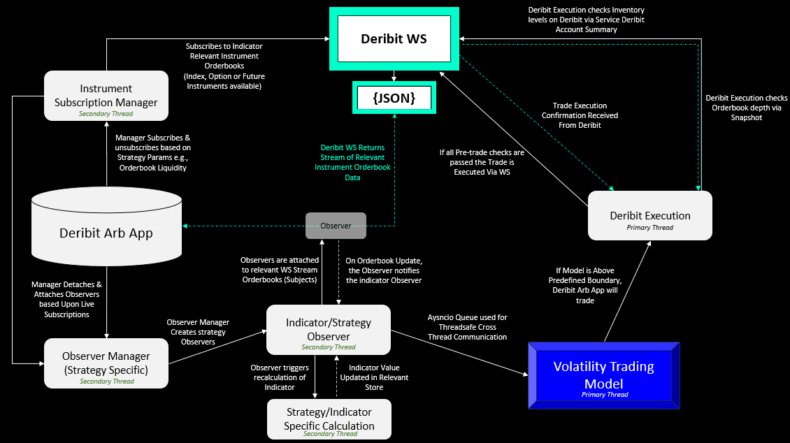

## **Deribit Arbitrage**

# Setup Deribit_Arbitrage

|Action|Command
| :-| :-
|Create a virtual environment| python -m venv .venv
|Install relevant libraries | pip install -r requirements.txt|
|Create a .env file and add it to the root | .env
|User needs Deribit Creds [if Live Account Trading]| https://www.deribit.com/register|
|User needs Deribit_testnet creds [if Testing] | https://www.testnet.deribit.com/register|
|Create json launch file| Open and Paste contents of launch_items.txt (ensure commas are correct)|
|register models in  deribit_arb_app\models.py | Models in list_of models.txt|
|Run Make Migrations|Run & debug -> dropdown Menu -> Make Migrations |
|If  No Migration Changes |Ensure migrations folder with blank __init__.py file in |
|Run Migrations|Run & debug -> dropdown menu -> Migrate|

# Enviroment Variables

|Environment variable|value|
| :-| :-
|CLIENT_ID|
|CLIENT_SECRET|
|DATABASE_NAME|
|DATABASE_USER|
|DATABASE_PASSWORD|
|DATABASE_PORT|
|MAX_WORKER|6|
|INSTRUMENTS_REFRESH_MINS|60|
|VSA_MINIMUM_LIQUIDITY_THRESHOLD|2500
|INSTRUMENTS_REFRESH|43200
|MINIMUM_LIQUIDITY_THRESHOLD|10000
|BASE_WS_URL|wss://www.test.deribit.com/ws/api/v2 |
|BASE_HTTP_URL|https://test.deribit.com/api/v2/public |

# Disclaimer
This repository was created as a proof of theory/concept and should not be utilized in a trading environment. The code in this repository is provided for educational purposes only, and it is the sole responsibility of the user to determine whether the code is suitable for their intended use. The author of this repository does not make any representation or warranty as to the accuracy, completeness, or reliability of the information & performance contained herein. The user should be aware that there are risks associated with trading and that trading decisions should only be made after careful consideration of all relevant factors. The author of this repository will not be held responsible for any losses that may result from the use of this code.

# Design Patterns

1. **The Factory Pattern**:
 ServiceDeribitMessaging
2. **Subject Observer Design Pattern**:
store_observable_orderbooks,
store_observable_index_prices,
bsm_implied_volatility_queue,
store_observable_volatility_index
3. **Producer Consumer Design Pattern**:
ServiceImpliedVolatilitySurfaceAreaTaskManager().build_vsa_tasks()

# Executive Summary
This repository provides infrastructure to execute trading strategies on the Deribit Exchange. The project can execute Trading strategies by implementing the Subject Observer Design Pattern, which is a behavioural pattern that defines a one-to-many dependency between objects so that when one object changes state, all its dependents are notified and updated automatically. 

The project provides the ability to observe multiple trading instruments and asynchronously trade and observe multiple trading strategies. This is done by utilizing a WebSocket connection to the Deribit exchange, which provides the ability to receive high-frequency trading data. All observable relationships, e.g., implied volatility of all currency-specific instruments, require some calculation, although all calculations have optimized to ensure optimal execution speed with spread computational load. Aysncio queues are implemented in the Producer Consumer design pattern, this provides the infrastructure to enable cross task/thread communication whilst decoupling producers & consumers.

Observers are employed to observe real-time instrument pricing on the Deribit Exchange, allowing the execution of arbitrage, relative value and spread trading strategies based on state changes. Price feeds are generated by subscribing to multiple instrument orderbooks via the ServiceDeribitInstrumentsSubscriptionManager, which provides the optionality of dynamic subscription management to reflect any dynamic live strategy. This project then provides the ability to utilise the observer managers, which allows for dynamic management of observations aligned with the management of subscriptions. 

# Option Valuation Model
Implied volatility estimations are done using the Newton-Raphson method to approximate the Implied Volatility in the Black-Scholes-Merton model. The Newton-Raphson method offers an efficient approach to approximate the implied volatility, via iteratively refining an initial guess for the implied volatility until the calculated option price converges to the market price within a desired precision. The Newton-Raphson method is ideal for this application due to its rapid convergence when compared to alternative models such as brute-force searching or bisection methods may require a larger number of calculations, resulting in higher latency.

# Architecture Design

  
