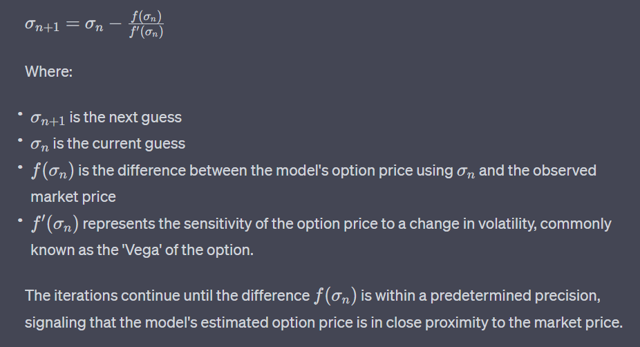
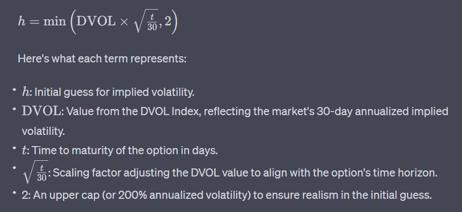
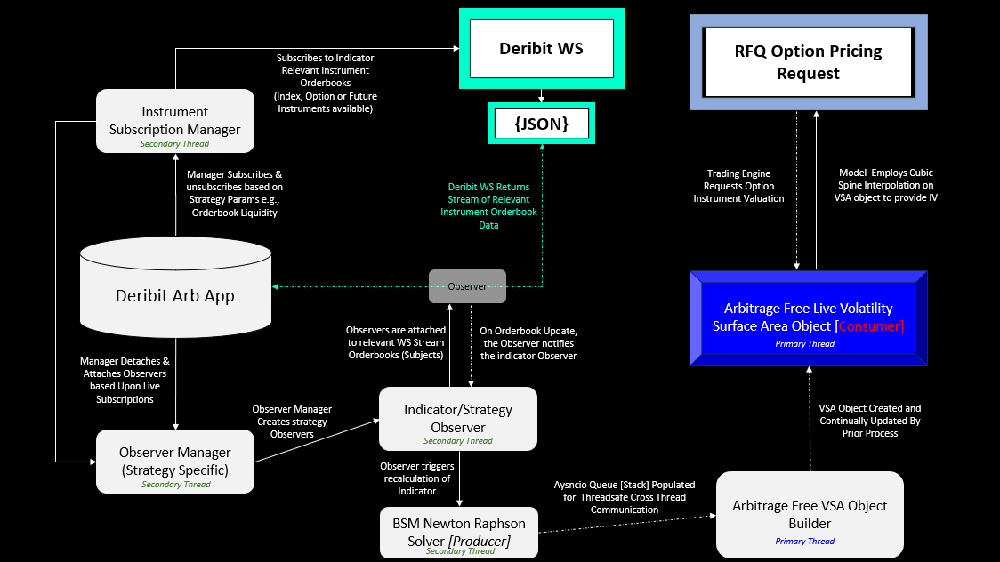

## **Deribit Volatility Surface Area**

# Disclaimer
This repository was created as a proof of theory/concept and should not be utilized in a trading environment. The code in this repository is provided for educational purposes only, and it is the sole responsibility of the user to determine whether the code is suitable for their intended use. The author of this repository does not make any representation or warranty as to the accuracy, completeness, or reliability of the information & performance contained herein. The user should be aware that there are risks associated with trading and that trading decisions should only be made after careful consideration of all relevant factors. The author of this repository will not be held responsible for any losses that may result from the use of this code.

# Executive Summary
This repository provides infrastructure to execute trading strategies on the Deribit Exchange. The project can execute Trading strategies by implementing the Subject Observer Design Pattern, which is a behavioural pattern that defines a one-to-many dependency between objects so that when one object changes state, all its dependents are notified and updated automatically. 

The project provides the ability to observe multiple trading instruments and asynchronously trade and observe multiple trading strategies. This is done by utilizing a WebSocket connection to the Deribit exchange, which provides the ability to receive high-frequency trading data. All observable relationships, e.g., implied volatility of all currency-specific instruments, require some calculation, although all calculations have optimized to ensure optimal execution speed with spread computational load. Aysncio queues are implemented in the Producer Consumer design pattern, this provides the infrastructure to enable cross task/thread communication whilst decoupling producers & consumers.

Observers are employed to observe real-time instrument pricing on the Deribit Exchange, allowing the execution of arbitrage, relative value and spread trading strategies based on state changes. Price feeds are generated by subscribing to multiple instrument orderbooks via the ServiceDeribitInstrumentsSubscriptionManager, which provides the optionality of dynamic subscription management to reflect any dynamic live strategy. This project then provides the ability to utilise the observer managers, which allows for dynamic management of observations aligned with the management of subscriptions. 

# Setup

|Action|Command
| :-| :-
|Create a virtual environment| python -m venv .venv
|Install relevant libraries | pip install -r requirements.txt|
|Create a .env file and add it to the root | .env
|User needs Deribit Creds [if Live Account Trading]| https://www.deribit.com/register|
|User needs Deribit_testnet creds [if Testing] | https://www.testnet.deribit.com/register|
|Create json launch file| Open and Paste contents of launch_items.txt (ensure commas are correct)|
|Run Make Migrations|Run & debug -> Dropdown Menu -> Make Migrations |
| Migration Errors |Ensure migrations folder with blank __init__.py file in |
|Run Migrations|Run & debug -> Dropdown Menu -> Migrate|

### Enviroment Variables

|Environment variable|value|
| :-| :-
|CLIENT_ID|
|CLIENT_SECRET|
|DATABASE_NAME|
|DATABASE_USER|
|DATABASE_PASSWORD|
|DATABASE_PORT|
|MAX_WORKER|6|
|VSA_MINIMUM_LIQUIDITY_THRESHOLD|2500
|INSTRUMENTS_REFRESH_SECONDS|3600|
|INSTRUMENTS_REFRESH|43200
|MINIMUM_LIQUIDITY_THRESHOLD|10000
|BASE_WS_URL|wss://www.test.deribit.com/ws/api/v2 |
|BASE_HTTP_URL|https://test.deribit.com/api/v2/public |

# Design Patterns

### 1. Subject Observer Design Pattern

The **Subject-Observer** design pattern is a behavioral pattern that defines a one-to-many relationship between objects. When the state of one object (the "subject") changes, all its dependent objects (the "observers") are notified and updated automatically. This pattern is central to event-driven programming and fits seamlessly with WebSocket-based systems.

**Subject:** The WebSocket instrument stream acts as the "subject". Whenever new market data arrives eg. orderbook data, the WebSocket stream changes its state.

**Observers:** These are components or functions interested in this market data, such as the Black-Scholes-Merton (BSM) calculations module, which computes implied volatility (IV). Every time new data arrives at the WebSocket stream (subject) [Spot Price, Dvol, TTM (Theta decay), Option Price], the BSM calculations (observer) are automatically triggered to update the IV for all related instruments.

---
### 2. Producer Consumer Design Pattern

The **Producer-Consumer** design pattern involves two main actors: the Producer (master), which produces data, and the Consumer (slave), which consumes that data. It's commonly used when data production and consumption occur at different rates.

**Producer:** Running on a non-primary thread, the producer handles all task utilised in the continous population of the stream of implied volatility objects. Since it's on a separate thread, it can continuously generate and populate data without interfering with the primary task of the application.

**Queue:** The implied volatility objects produced by the Producer are placed in a shared buffer or queue. This intermediate storage allows for the producer and consumer to work at their own paces without directly depending on the immediate availability of each other.

**Consumer:** Running on the primary thread, the consumer retrieves the implied volatility objects from the buffer or queue and processes them. It ensures that the core computation (volatility surface creation) is given primary system resources and focus.

# Option Valuation Model
Implied volatility estimations are done using the Newton-Raphson method to approximate the Implied Volatility in the Black-Scholes-Merton model. The Newton-Raphson method offers an efficient approach to approximate the implied volatility, via iteratively refining an initial guess for the implied volatility until the calculated option price converges to the market price within a desired precision. The Newton-Raphson method is ideal for this application due to its rapid convergence when compared to alternative models such as brute-force searching or bisection methods may require a larger number of calculations, resulting in higher latency.

## Newton-Raphson Methodology
Rooted in calculus, this iterative method refines an initial guess for the implied volatility by using the derivative (or 'gradient') of the function. The iterations continue until the estimated option price is in close proximity to the market price, within a predetermined precision. Its inherent design leverages the tangent line's slope at the current guess point, ensuring swift adjustments and rapid convergence to the accurate implied volatility.

## Optimised Initial Guess logic - Scaled Dvol
The DVOL Index from Deribit encapsulates the market's 30-day forward-looking implied volatility, serving as a progressive alternative to retrospective historical volatility measures. Leveraging this, this model uses the DVOL value, scaled by the square root of the option's maturity relative to 30 days, as an initial guess for implied volatility estimations. This ensures alignment with the option's time horizon, while also setting a pragmatic cap at 200% annualized volatility to account for potential data anomalies or extreme market situations.

# Arbitrage-Free Volatility Surface Methodology

### 1. Theoretical Foundations

#### Monotonicity in Time-to-Maturity (Calendar Arbitrage)
Historical data suggests that calendar spreads, which involve opposite positions in options with different expirations but identical strikes, rarely guarantee a risk-free profit. My methodology ensures that the implied volatility for a given strike doesn't decrease with a longer time-to-maturity. This aligns with the notion that extended durations inherently introduce more uncertainty, thereby justifying a non-decreasing volatility trend.

#### Convexity in Strikes (Butterfly Arbitrage)
The butterfly spread, composed of three options of the same type and expiry but with varying strikes, should not yield arbitrage profits. Empirical studies, like that of Dumas, Fleming, and Whaley (1998), validate this perspective. My model ensures that the second derivative of implied volatility concerning the strike price remains non-negative. This not only prevents butterfly arbitrage opportunities but also reflects observed market behavior.

#### Monotonicity in Strikes (Strike Arbitrage)
The variation of implied volatilities across different strikes is evident in phenomena such as the "volatility smile" and the "volatility skew". Backed by Black's approximation (1976) and various market crash models, my methodology enforces a structure wherein implied volatility either increases or remains unchanged as strike prices decrease.

---

### 2. Practical Implications

An arbitrage-free surface holds significance not just in theoretical discussions but in practical applications:

- **Consistent Valuation:** It enables consistent evaluations across a variety of products, facilitating derivatives pricing and risk management.
  
- **Robustness in Hedging:** The surface ensures that hedging strategies are safeguarded against guaranteed losses, which can arise from surfaces that permit arbitrage.
  
- **Model Stability:** Arbitrage-free surfaces generally exhibit smoother behaviors and are less swayed by market noise.

---

### 3. Methodology Implementation

In developing a methodological approach for the volatility surface, I've emphasized adherence to non-arbitrage theories while leveraging computational methods to ensure precision and efficiency.Central to my approach is the RectBivariateSpline, a tool designed for two-dimensional data interpolation. Its significance in this context is:

**Dimensionality Alignment:** The volatility surface operates in a two-dimensional framework, marked by moneyness and time-to-maturity. The RectBivariateSpline, by design, caters to such bi-dimensional data, ensuring precise interpolations.

**Ensuring Continuity:** Financial models are sensitive to abrupt transitions, which can induce mispricing or arbitrage. The RectBivariateSpline delivers a smooth volatility surface, essential for accurate derivatives pricing and risk assessment.

**Responsive Modeling:** Unlike more rigid interpolation techniques, the RectBivariateSpline tailors itself to the data's peculiarities. This adaptability results in a volatility surface that resonates with market subtleties, balancing theoretical robustness with practicality.

In sum, my incorporation of the RectBivariateSpline aligns mathematical rigor with market dynamics, ensuring a volatility surface that's attuned to real-time market nuances.

# Architecture Design

  
